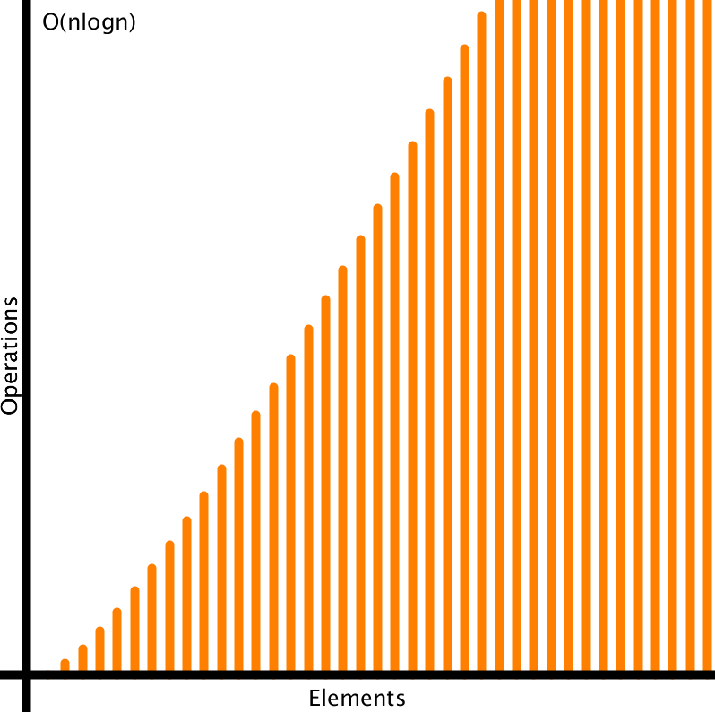

# processing-complexity-grapher

## Concept

A plot displaying different runtime complexities of programming algorithms.

## Usage

Navigate to ```complexitygrapher/complexitygrapher.pde``` and open with the Processing IDE.

Run in the Processing IDE or export to application and execute.

Press the spacebar to cycle through the runtime complexities. Press the W or S keys to increase or decrease the scale of the plot, respectively.

## Demo Image


